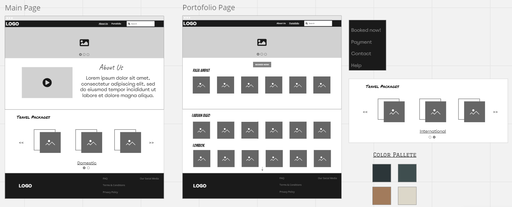
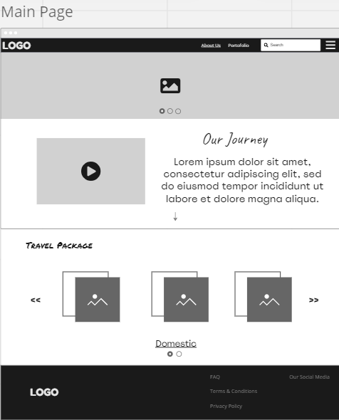
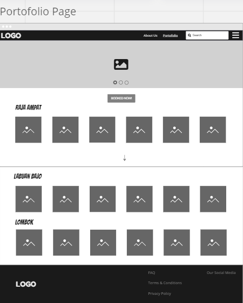
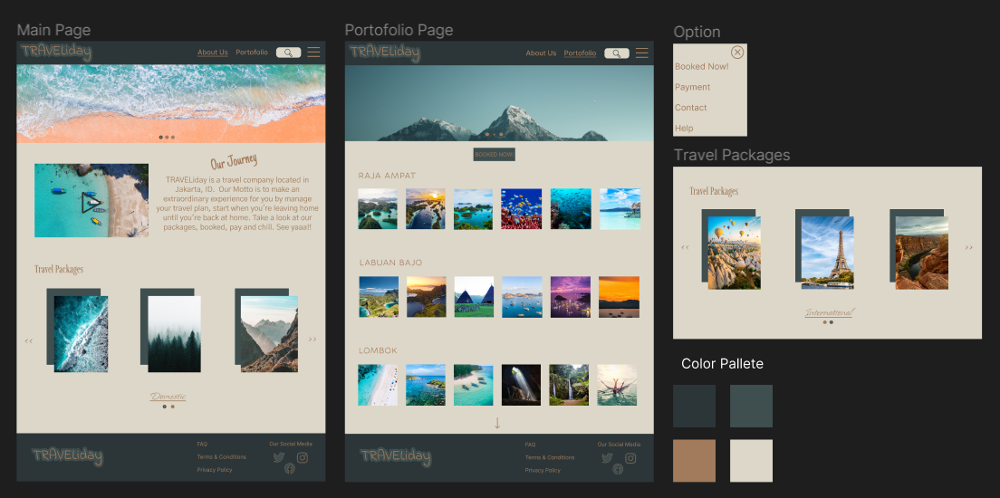
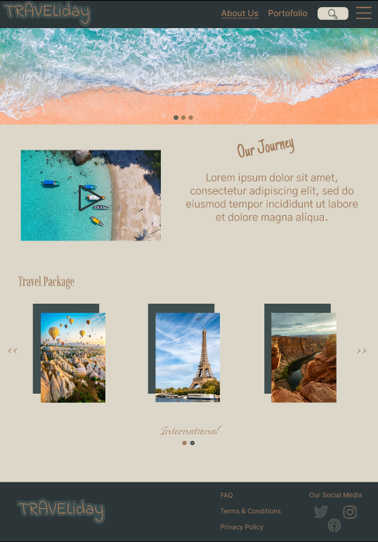
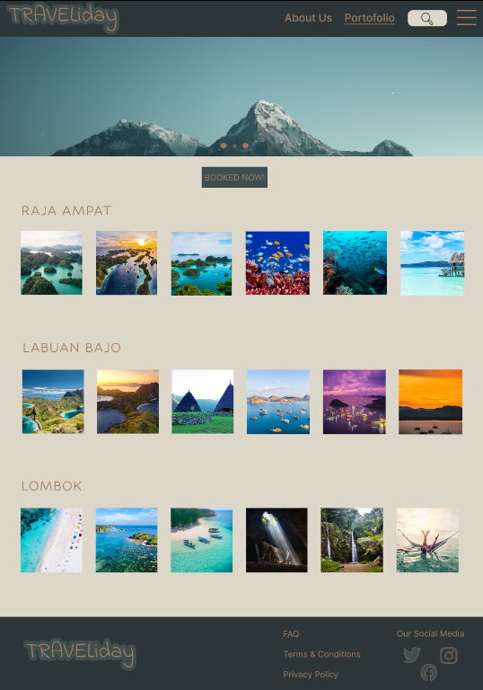

# UI UX

> This is an example of my website design

## Description

This is a Travel Website, I made it using Miro and Figma for an example of company profile website.

## Preview

Link Miro : https://miro.com/app/board/uXjVPvG4OtM=/?share_link_id=758796936373

Link Figma : https://www.figma.com/proto/GiKPi2Gv50bRdCixZPdHxG/w3-my-website-design?page-id=0%3A1&node-id=11%3A2&viewport=255%2C190%2C0.15&scaling=scale-down&starting-point-node-id=11%3A2

## Sources and Inspiration

- Images : https://unsplash.com/
- Color : https://colorhunt.co/

- https://www.pocarisweat.id/
- https://www.telkom.co.id/

## Screenshoots

Miro (Wireframe)

 

Figma (Mock Up and Prototype)

 
